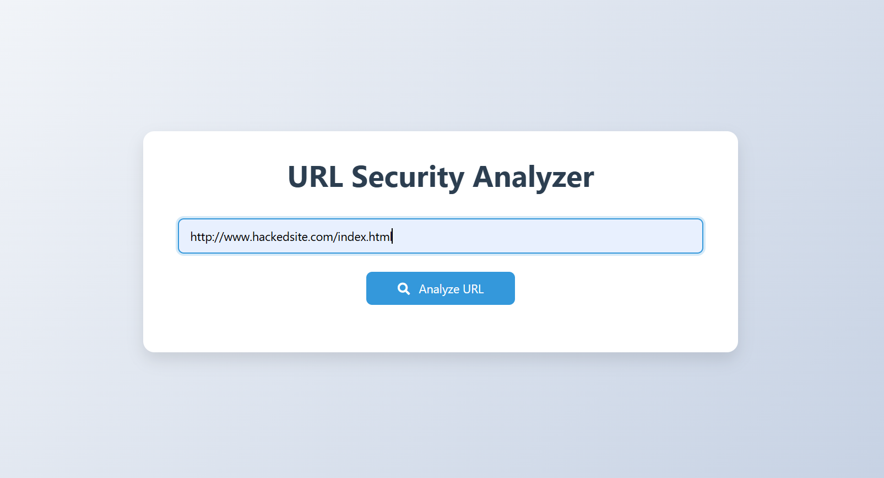
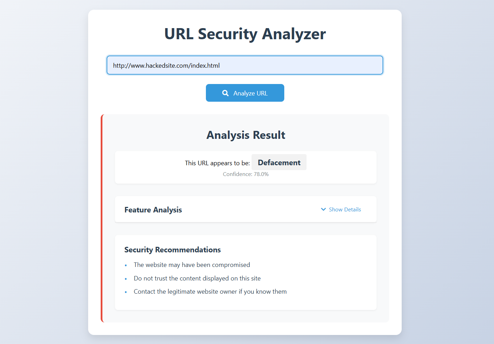
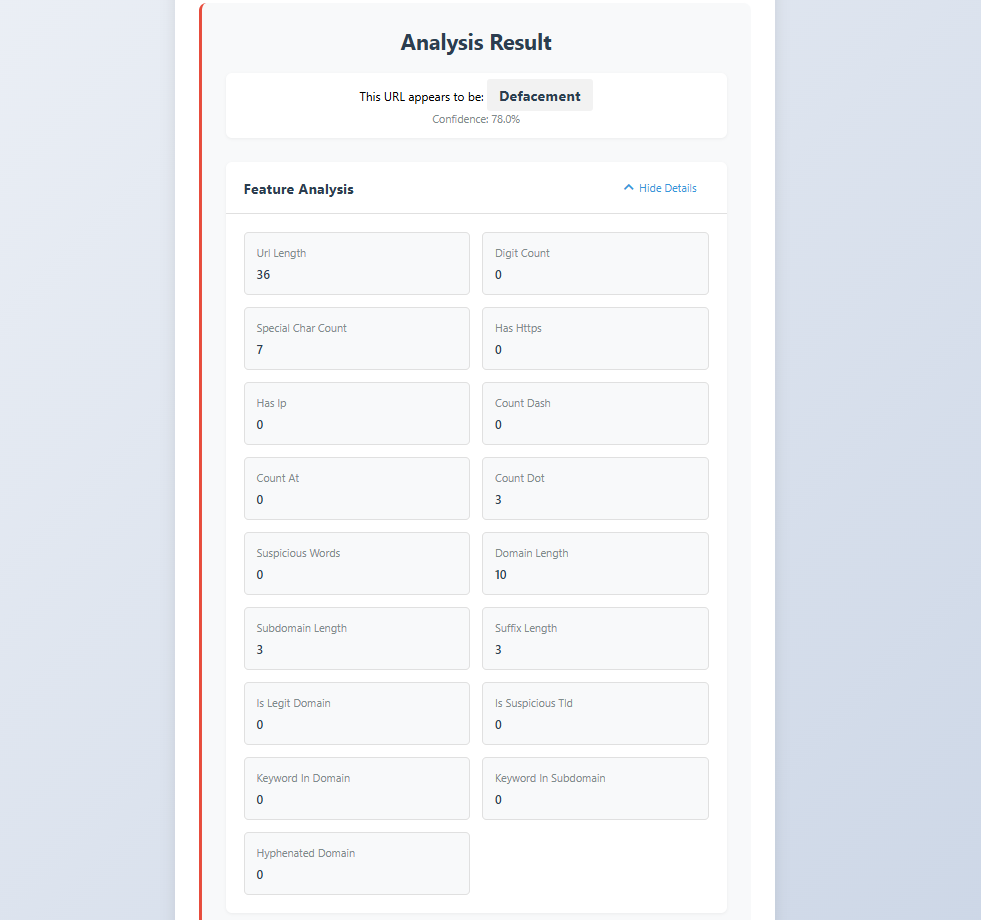

## PhishScan – Phishing URL Detection Web App


### Overview
**PhishScan** is a web-based tool that analyzes URLs using trained **Random Forest** and **XGBoost** models to classify them as **Benign**, **Malware**, **Defacement**, or **Phishing**.  

It extracts **17 key features** from the URL and provides an **instant threat prediction** along with **security recommendations** based on the result.


### Core Features
- Real-Time URL Classification using trained ML models  
- Feature Extraction from input URLs (e.g., HTTPS status, domain age, suspicious symbols)  
- Dual Model Integration: XGBoost & Random Forest for enhanced accuracy  
- Security Recommendations based on threat type (phishing, malware, etc.)  
- Flask Web Interface for smooth user interaction  
- Visual Feedback: Displays predicted category and extracted features  
- Responsive UI: Mobile-friendly and accessible

### Dataset
Source: [Malicious URLs Dataset on Kaggle](https://www.kaggle.com/datasets/sid321axn/malicious-urls-dataset)  
- Total URLs: ~650,000+  
- Categories: Benign, Malware, Phishing, Defacement  
- Features Extracted: 17 (e.g., URL length, presence of IP, '@' symbol, domain age)

### Setup & Configuration
1. Clone the Repository
```bash
git clone https://github.com/ravishaa2005/Phishing-URL-Detection-Random-Forest-XGBoost-.git
cd Phishing-URL-Detection-Random-Forest-XGBoost-
```

2. Create Virtual Environment & Install Dependencies
```bash
pip install -r requirements.txt
```

3. Model Training
```bash
python train_model.py
```

4. Run the Flask App
```bash
python app.py
```

5. Access the App on browser

### Model Accuracy

| Model         | Accuracy |
|---------------|----------|
| Random Forest | 95.3%    |
| XGBoost       | 96.7%    |


### App Screenshots

| Home Page                                | URL Input & Results                       | Feature Table                            |
|------------------------------------------|-------------------------------------------|------------------------------------------|
|           |   |   |
